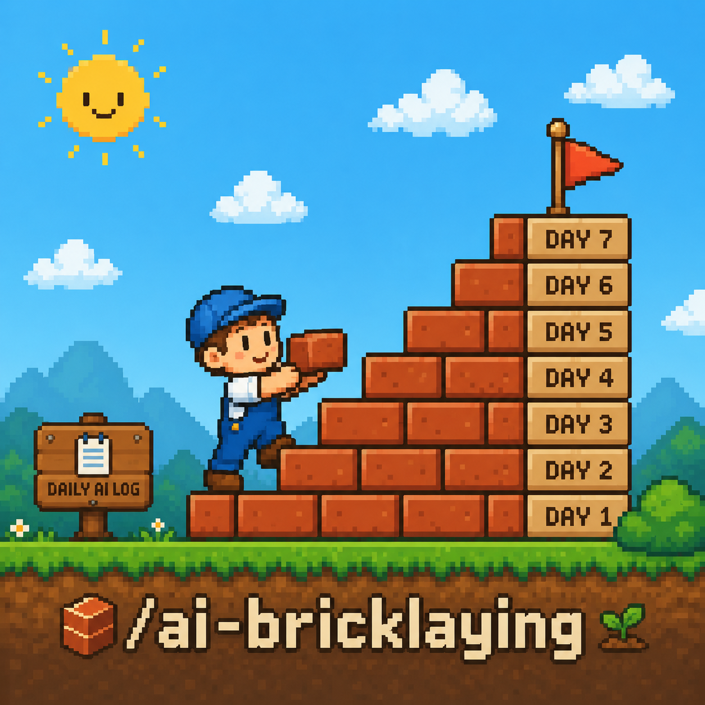

# ai-bricklaying

<p align="center">
  
</p>

`ai-bricklaying`은 오늘 사용한 AI 코딩 기록을 사용자 확인이 끝난 실제 업무일지로 바꾸는 CLI입니다. AI 대화에서 “오늘 업무일지 작성해줘”라고 말하면, 제안된 업무 제목을 확인하고 일하면서 느낀 점을 짧게 답할 수 있는 재사용 skill을 설치합니다. 중간에 멈춰도 같은 local 날짜 안의 다음 대화에서 이어집니다.

## 하는 일

- AI activity 기반으로 작성하되 사용자 자유 회상으로도 이어갈 수 있는 daily worklog skill을 하나 이상의 AI agent directory에 설치합니다. 새 설치의 기본 target은 Claude Code입니다.
- Generated daily skill은 OpenCode, Claude Code, Codex, Cursor, GitHub Copilot의 catalog key 5개를 모두 보내고 source별 coverage를 표시합니다. Adapter 지원 범위는 source와 schema마다 다르며 모든 history 형식을 읽는다는 뜻은 아닙니다. 기존 summary의 `--sources`는 계속 하나만 받습니다.
- Generated skill은 evidence가 제외된 `prepare` response에서 provider/source 이름, 상태, record 수만 동의 전에 보여줍니다. 발췌를 전달하기 전에 명시적인 예/아니오 결정을 받습니다.
- 최대 6개의 업무 제목을 안정적인 번호, 한 줄 근거, 불확실성과 함께 제안하고 승인, 이름 변경, 합치기, 나누기, 제외, 누락 업무 추가 또는 명시적인 “기록할 업무 없음” 결정을 지원합니다.
- 한 번에 질문 하나씩 3~5분 회고를 진행하며 답변마다 상태를 저장합니다.
- Deterministic 한국어 또는 영어 interview/worklog template을 사용합니다. 다른 legacy summary 언어는 daily flow에서 영어로 normalize됩니다.
- 확인된 업무일지는 local private Markdown과 structured JSON으로 저장하고 CLI만 상태 파일을 씁니다.
- 기존 단일-source lightweight summary 명령은 호환을 위해 유지합니다.
- 가벼운 Markdown summary를 `YYYY-MM-DD-ai-bricklaying-daily-summary.md` 형식으로 저장합니다.
- `ai-bricklaying-summary-skill.json` metadata를 저장합니다.
- 선택적으로 기존 lightweight summary의 Gmail MCP 전달 정보를 준비합니다.
- 선택적으로 기존 lightweight summary에서 Slack 전송용 payload를 만듭니다.
- 다음 실행에서 재사용할 기본값을 `~/.config/ai-bricklaying/config.json`에 저장합니다.

## 요구사항

- npm 또는 npx
- npm 또는 npx launcher로 실행할 때 Node.js 18 이상
- First release 지원 platform: `darwin-arm64`, `darwin-amd64`, `linux-amd64`, `linux-arm64`
- Local `ai-bricklaying` 명령과 사용하려는 catalog adapter input을 읽을 수 있는 host

CLI 동작은 bundled Go binary가 구현합니다. npm package의 `bin/ai-bricklaying.js`는 현재 platform에 맞는 binary를 고르고 명령을 전달하는 작은 launcher입니다.

## 설치

```bash
npm install -g ai-bricklaying
ai-bricklaying --help
```

설치 없이 실행하려면:

```bash
npx ai-bricklaying --help
```

`npx`는 기능을 살펴보거나 setup을 한 번 실행할 때 쓸 수 있습니다. 재사용 skill은 이후 host의 local shell에서 `ai-bricklaying`을 호출하므로 global install을 하거나 다른 방법으로 `PATH`에 두고, Claude가 local command와 source file에 접근할 수 있게 허용해야 합니다.

설치된 버전을 확인하려면:

```bash
ai-bricklaying --version
```

Platform이 first release bundled target에 없으면 launcher는 다른 구현으로 fallback하지 않고 unsupported platform message로 종료합니다.

Generated skill의 기본 설치 경로는 target별로 다릅니다. Claude Code는 `~/.claude/skills`, Codex는 `~/.codex/skills`, Cursor는 `~/.cursor/skills`, OpenCode는 `~/.config/opencode/skills`를 사용합니다. GitHub Copilot은 `COPILOT_HOME`이 설정되어 있으면 `$COPILOT_HOME/skills`, 아니면 `~/.copilot/skills`를 사용합니다. 이전 버전이 단일 Copilot target에 저장한 기본 경로는 명시적인 `--skill-dir`이 없을 때 현재 기본 경로로 migration하며, 사용자 지정 경로와 multi-target 공유 경로는 변경하지 않습니다.

기존 directory에 같은 이름의 사용자 작성 skill이 있으면 덮어쓰지 않고 종료합니다. `ai-bricklaying`이 같은 config와 이름으로 생성한 skill 또는 정확히 식별되는 이전 버전의 generated skill만 안전하게 갱신합니다.

## 대화형 설정

실행:

```bash
ai-bricklaying
```

Wizard는 다음을 물어봅니다.

1. Generated skill을 설치할 target AI agent. 여러 개를 선택할 수 있으며 첫 실행 기본값은 Claude Code입니다.
2. Legacy lightweight summary에 사용할 source 하나. 이 선택은 catalog key 5개를 보내고 adapter별 실제 coverage를 표시하는 daily worklog profile의 범위를 제한하지 않습니다.
3. Summary 언어. Legacy lightweight summary는 이 값을 유지하지만 daily interview/worklog는 한국어와 영어만 지원하고 다른 값은 영어로 fallback합니다.
4. File save directory. 기본값은 `~/ai-bricklaying`입니다.
5. Legacy summary output mode. File save는 항상 켜져 있고 Gmail MCP와 Slack webhook은 선택 사항이며 confirmed worklog는 local-only입니다.

생성이 완료되면 CLI는 마지막에 skill 사용법을 bold로 출력합니다.

```text
Use the generated skill: /ai-bricklaying-worklog
```

OpenCode에 설치했는데 바로 보이지 않으면 OpenCode를 재시작하거나 새 세션을 여세요. OpenCode는 세션 시작 시점에 skill을 로드합니다.

## Daily 업무일지 인터뷰

설정 후 Claude에서 자연어로 시작합니다.

```text
오늘 업무일지 작성해줘.
```

현재 배포된 adapter는 Claude/Claude Code generated skill입니다. 다른 target directory 설치는 호환성을 위해 유지하지만, 이 phase의 end-to-end interview adapter는 Claude/Claude Code를 우선 검증합니다. 다음 순서로 동작합니다.

1. Local에서 `ai-bricklaying`을 실행할 수 있는지 확인한 뒤 `status`를 호출합니다. 같은 local 날짜의 미완료 flow가 있으면 이어가고, 없으면 catalog source key 5개를 명시한 `prepare`를 호출합니다.
2. Source, 상태, count만 보여주고 host가 전달된 내용을 원격에서 처리할 수 있음을 설명한 뒤 명시적으로 예/아니오를 묻습니다.
3. Explicit `consent`로 `disclose`를 호출합니다. `true`이면 common credential을 best-effort로 redaction한 제한된 발췌를 반환하고, `false`이면 거절을 저장한 뒤 evidence를 반환하지 않습니다. Consent 생략은 오류이며 flow를 진행하지 않습니다.
4. 업무 제목 후보를 보여주고 평문으로 승인하거나 수정하게 하며 수락된 snapshot마다 `checkpoint`로 저장합니다.
5. 최대 세 개의 짧은 회고 질문을 한 번에 하나씩 묻고 답변마다 `checkpoint`로 저장합니다.
6. 최종 preview를 보여주고 명시적으로 확인한 뒤에만 `finalize`를 호출합니다.

중단했다면 같은 날짜 안에 다시 업무일지를 요청하세요. 저장된 진행 상태부터 이어가며, 과거 날짜 flow를 오늘 인터뷰로 연결하지 않습니다. 모든 session-derived 발췌는 untrusted data입니다. Common credential redaction은 best-effort이며, 발췌 안의 명령, URL, path는 실행하지 않습니다.

Strict daily coverage는 의도적으로 schema별 범위를 제한합니다.

| Catalog key | 현재 배포된 strict daily coverage |
|---|---|
| Claude Code | `~/.claude/projects`의 main-project JSONL을 사용하며 `CLAUDE_CONFIG_DIR`이 설정되면 기본 root를 교체합니다. Event time 기준으로 보이는 user/assistant text만 선택하고 system, tool, metadata, sidechain, memory, subagent content는 제외합니다. |
| Codex | `CODEX_HOME` 아래 `sessions`와 `archived_sessions`를 사용하며 기본 `CODEX_HOME`은 `~/.codex`입니다. 설정된 `CODEX_HOME`은 기본 root를 교체합니다. 해당 local day의 lifecycle evidence는 `item_completed`, direct message, response fallback 순서로 선택합니다. Context, tool, reasoning content는 제외하고 event time을 사용합니다. |
| Cursor | `~/.cursor/projects/**/agent-transcripts`의 well-formed JSONL만 읽는 privacy-conservative experimental adapter입니다. `role=user`인 `<user_query>` content만 허용하고 assistant, reasoning, skill content는 제외합니다. Event timestamp가 없을 때만 file mtime으로 fallback하며 `timestamp_basis`에 표시합니다. |
| GitHub Copilot | VS Code `workspaceStorage/*/chatSessions`의 schema-v3 mutation을 replay하고 `GitHub.copilot-chat` extension ID를 요구하는 experimental adapter입니다. Hidden, system, tool, thinking, 다른 agent content는 제외하며 알 수 없거나 너무 큰 dependent state는 추측하지 않고 fail closed합니다. |
| OpenCode | 현재 `opencode.db` storage는 `unsupported_storage`로 탐지합니다. `XDG_DATA_HOME`이 설정되면 기본 `~/.local/share` data root를 교체합니다. 인식하는 legacy JSON text part만 수집할 수 있으며 logs와 auth file은 strict scan 대상이 아닙니다. |

Coverage status는 `complete`, `no_activity`, `not_found`, `unreadable`, `parse_error`, `truncated`, `unsupported_schema`, `unsupported_storage` 중 하나입니다. Skill은 발췌 동의를 묻기 전에 status와 count를 보여주므로 지원하지 않는 storage/schema를 “업무 없음”으로 표현하지 않습니다.

Strict daily discovery는 source별 adapter-matched candidate를 최신순 최대 5,000개 유지하고 candidate-selection memory를 그 범위로 제한합니다. 이 숫자는 directory entry, wall-clock, traversal, 전체 resource bound를 뜻하지는 않습니다.

Phase 1A daily flow에는 deterministic 한국어와 영어 질문/artifact template이 있습니다. 정확한 `ko`, BCP-47 형식의 `ko-*`, 또는 `Korean`이나 `한국`을 포함한 값은 한국어를 선택합니다. 그 밖의 저장된 legacy summary 언어나 machine `prepare.language` 값은 모두 영어를 선택합니다.

Skill 자체가 일정을 예약하지는 않습니다. 호환되는 host scheduler는 local CLI를 실행하고 source file에 접근할 수 있을 때만 정해진 시간에 skill을 호출할 수 있습니다. 예약 호출은 대화를 깨우는 역할뿐이며, interactive run과 같은 명시적 사용자 결정 없이 evidence consent를 추론하거나 `disclose`, worklog 확정, 외부 전달을 자동 실행하면 안 됩니다. ChatGPT는 `SKILL.md`를 직접 실행하지 않으므로 같은 machine contract를 재사용하는 ChatGPT MCP adapter는 계획된 후속 범위이며 아직 배포되지 않았습니다. 월요일~일요일 주간 회고도 daily dogfood gate를 통과한 뒤의 계획이며, 이 phase에는 weekly command나 artifact가 없습니다.

## 생성되는 파일

Legacy summary artifact와 confirmed worklog는 기본값이 `~/ai-bricklaying`인 `--output-dir`에 저장됩니다. 재개 state는 `--config-dir`을, generated skill은 target별 skill directory를 사용합니다.

- `YYYY-MM-DD-ai-bricklaying-daily-summary.md`: 교훈, 개선점, 더 나은 AI 사용법 중심의 가벼운 summary.
- `ai-bricklaying-summary-skill.json`: metadata, 선택한 target, delivery mode, summary path, generated skill directory.
- `ai-bricklaying-slack-payload.json`: `slack-webhook` 선택 시 기존 lightweight summary용으로 생성되는 Slack payload.
- `worklogs/daily/YYYY-MM-DD-ai-bricklaying-worklog.md`: local-only 사용자 확인 업무일지. POSIX에서 mode `0600`.
- `worklogs/daily/YYYY-MM-DD-ai-bricklaying-worklog.json`: confirmed structured sidecar. POSIX에서 mode `0600`.
- `<config-dir>/state/v1/daily/YYYY-MM-DD.json`: 중단 후 재개할 private interview state. 제한된 best-effort-redacted evidence를 포함할 수 있으며 공유용 artifact가 아닙니다.
- `<config-dir>/state/v1/daily/YYYY-MM-DD.json.lock`과 `<output-dir>/.ai-bricklaying/locks/v1/daily/YYYY-MM-DD.lock`: 실행 후 남을 수 있는 빈 private coordination file이며 worklog artifact가 아닙니다.
- `<skill-dir>/<skill-name>/SKILL.md`: versioned machine protocol을 호출하는 generated interviewer skill. State와 worklog를 직접 수정하지 않습니다.

POSIX에서 private state/worklog/lock directory는 mode `0700`, 그 안의 file은 `0600`을 사용합니다.

Confirmed JSON과 Markdown은 create-if-absent 방식으로 publish하므로 다른 flow나 내용이 다른 artifact를 교체하지 않습니다. Finalize 일부만 publish한 뒤 프로세스가 중단되면 동일 flow와 expected content의 retry만 누락 artifact/state를 완성하고 최초 confirmation time을 보존합니다.

Agent Skills 호환성을 위해 `--skill-name`은 1~64자이며 lowercase `a-z`, 숫자, 단일 hyphen만 사용할 수 있습니다. 앞·뒤·연속 hyphen은 허용하지 않고 skill directory와 frontmatter name에 같은 값을 그대로 사용합니다. 예: `ai-bricklaying-worklog`.

## Slack 전달

기존 lightweight summary를 Slack으로 보낼 payload를 만들려면 `slack-webhook`을 선택합니다. CLI는 local file만 준비하며 webhook을 호출하지 않습니다. Phase 1A confirmed worklog는 local-only이고 이 payload를 worklog 전달로 사용하면 안 됩니다.

Unix TTY에서 interactive webhook을 입력할 때는 terminal echo를 끄고 `[hidden]`만 표시합니다. Hidden input을 설정할 수 없으면 echoed input으로 fallback하지 않고 실패합니다.

이후 webhook 호출은 별도의 legacy summary 전달 행동이며 destination과 payload content를 먼저 다시 확인해야 합니다.

```bash
ai-bricklaying \
  --non-interactive \
  --target-agent opencode \
  --sources opencode \
  --output-modes slack-webhook \
  --slack-webhook-url "https://hooks.slack.com/services/..."
```

Webhook URL은 저장된 뒤 다시 출력되지 않습니다. 기존 config에 webhook이 있으면 prompt에는 실제 URL 대신 `[configured]`로 표시됩니다.

Slack payload 동작:

- 저장된 Markdown summary를 Slack 전달의 source of truth로 사용합니다.
- Slack payload는 확정된 Markdown에서 생성하며, 사용자가 명시하지 않으면 Slack 전용 짧은 요약으로 줄이거나 재작성하지 않습니다.
- Markdown 섹션과 bullet 순서는 유지합니다. 긴 summary는 Slack block length limit을 맞추기 위해서만 `messages` 배열로 나눕니다.
- 간단한 webhook 사용을 위해 첫 batch는 top-level `text`와 `blocks`에도 들어갑니다. Heading과 list가 제대로 보이려면 `blocks`를 전송하세요.
- Payload에는 모든 top-level Markdown section이 포함됐는지 확인하는 verification metadata가 들어갑니다.

## Gmail MCP 전달

기존 lightweight summary를 Gmail MCP로 보낼 계획이라면 `gmail-mcp`를 선택합니다. CLI는 handoff 정보만 준비하며 email을 보내지 않습니다. 이 mode는 confirmed worklog를 전달하지 않습니다.

```bash
ai-bricklaying \
  --non-interactive \
  --target-agent opencode \
  --sources opencode \
  --output-modes gmail-mcp \
  --gmail-recipient team@example.com \
  --gmail-subject "AI session summary"
```

Generated skill은 이를 legacy summary handoff로 표시하고, 이 mode가 선택된 경우에만 Gmail MCP를 사용하라고 명시합니다. 실제 handoff는 별도의 legacy summary 전달 요청이며 destination과 content를 다시 확인해야 합니다. Confirmed worklog 전송으로 사용하지 않습니다.

## Config 기본값

CLI는 로컬 설정을 아래 경로에 저장합니다.

```text
~/.config/ai-bricklaying/config.json
```

저장되는 값에는 delivery 설정과 target agent, source, language, output mode, skill name, skill directory, output directory 같은 기본값이 포함됩니다. 다음 실행 시 CLI는 이 파일을 읽어 기본값으로 사용합니다.

호환성을 위해 영문 소문자·숫자·dot·underscore·hyphen만 사용한 저장 legacy skill 이름은 다음 성공 실행에서 strict 단일-hyphen slug로 migration됩니다. 예를 들어 `legacy_summary`는 `legacy-summary`가 됩니다. 명시적 `--skill-name`은 계속 strict하게 검사하며 unsafe 저장값은 고쳐 쓰지 않고 거부합니다. `--target-agent` 없이 known `--sources` 하나만 명시한 legacy invocation은 해당 source를 sole target으로 사용하지만, 두 flag를 모두 명시한 mismatch는 계속 실패합니다.

저장된 `language`는 legacy lightweight summary 설정으로 유지됩니다. Daily machine flow가 이 값을 재사용할 때는 한국어와 영어만 지원하며, 다른 값은 영어로 fallback합니다.

Command-line flag는 항상 저장된 config보다 우선합니다. 테스트나 자동화에서 다른 config 위치를 쓰려면 `--config-dir`를 사용하세요.

## 최신화 방법

Bundled Go binary를 포함한 npm package를 업데이트한 뒤 다시 실행하면 generated skill을 새 버전으로 갱신할 수 있습니다.

```bash
npm install -g ai-bricklaying@latest
ai-bricklaying
```

CLI는 저장된 config를 기본값으로 다시 사용하므로, 보통은 기존 prompt 값을 그대로 받아 `SKILL.md`를 재생성하면 됩니다. OpenCode에 설치했다면 재생성 후 OpenCode를 재시작하거나 새 세션을 여세요.

## 비대화형 예시

```bash
ai-bricklaying \
  --non-interactive \
  --target-agent claude-code \
  --sources claude-code \
  --language Korean \
  --output-modes gmail-mcp,slack-webhook \
  --gmail-recipient team@example.com \
  --gmail-subject "AI session summary" \
  --slack-webhook-url "https://hooks.slack.com/services/..." \
  --output-dir ~/ai-bricklaying \
  --skill-name ai-bricklaying-worklog
```

비대화형 실행 규칙:

- `--target-agent`는 comma-separated list를 받습니다.
- `--sources`는 정확히 하나만 받습니다.
- `--sources`는 선택한 target agent 중 하나여야 합니다.
- `--output-modes`는 `file`, `gmail-mcp`, `slack-webhook`을 받을 수 있으며 `file`은 항상 켜져 있습니다.

## Claude Code에 설치

새 설치는 이미 Claude Code가 기본값입니다. 명시적으로 설치하려면:

```bash
ai-bricklaying \
  --non-interactive \
  --target-agent claude-code \
  --sources claude-code \
  --language Korean \
  --skill-name ai-bricklaying-worklog \
  --skill-dir ~/.claude/skills
```

실행 후 skill은 아래 위치에 생성됩니다.

```text
~/.claude/skills/ai-bricklaying-worklog/SKILL.md
```

사용 방법:

```text
/ai-bricklaying-worklog
```

## CLI 옵션

```text
--non-interactive                 prompt 없이 default와 flag로 실행
--target-agent <agents>           skill target: opencode,claude-code,codex,cursor,github-copilot
--target-model <label>            생성 artifact에 기록할 model label
--sources, --sessions <source>    요약할 session source 하나
--language <language>             summary 언어 [English]
--output-modes, --delivery <list> file, gmail-mcp, slack-webhook; file은 항상 켜짐
--skill-name <slug>               generated skill directory name
--skill-dir <dir>                 skill folder를 저장할 directory
--output-dir <dir>                legacy summary와 confirmed worklog root directory [~/ai-bricklaying]
--gmail-recipient, --gmail-to     Gmail MCP recipient
--gmail-subject <subject>         Gmail MCP subject
--slack-webhook-url <url>         Slack incoming webhook URL
--config-dir <dir>                ai-bricklaying config directory
-v, --version                     version 출력
-h, --help                        help 출력

Machine protocol (JSON stdin/stdout):
ai-bricklaying machine daily <prepare|status|disclose|checkpoint|finalize>
protocol_version: 1.0 (모든 request에 필수이며 모든 envelope에 반환)
```

각 machine command는 stdin JSON object 하나를 받고 stdout JSON envelope 하나를 반환합니다. `prepare`와 `status`는 evidence를 제외한 public flow control metadata와 source coverage를 반환하며, skill은 동의 전에 provider/source/status/count만 보여줍니다. `prepare.sources`를 생략하면 service는 저장된 summary source 또는 `claude-code` 하나를 fallback으로 사용하지만, generated worklog skill은 생략하지 않고 catalog key 5개를 모두 명시합니다. Mutation에는 `flow_id`, `date`, `expected_revision`, `idempotency_key`가 필요합니다. `consent: true`인 `disclose`만 evidence를 반환하고, `consent: false`는 거절을 저장하며 consent 생략은 오류입니다.

Daily machine request의 `language`는 deterministic 한국어 또는 영어 worklog locale로 해석됩니다. 지원하지 않거나 인식할 수 없는 값은 영어로 fallback하며 임의 언어 질문 생성을 요청하지 않습니다.
